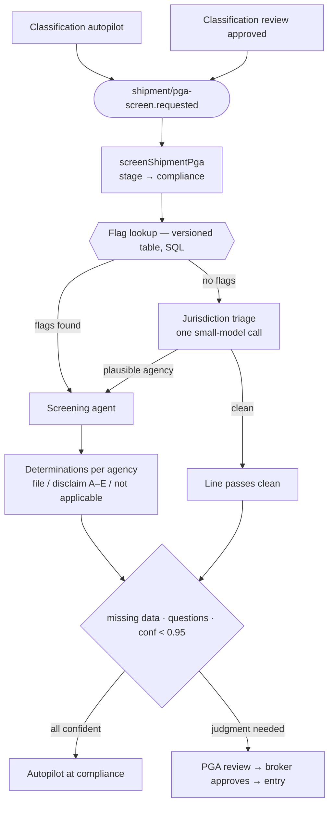

# PGA screening agent

Partner Government Agency (PGA) screening is the compliance step an expert
broker performs after classification: given a line's 10-digit HTS code and
this shipment's facts, decide which agencies (FDA, APHIS, EPA, NHTSA, FWS,
NMFS, TTB, DEA, CPSC, …) have a claim on the entry, and for each one —
**file** the agency's data, formally **disclaim** it with a coded
declaration (A–E), or record that it is **not applicable**.

Classification is per-*product* and cacheable; PGA applicability is
per-*shipment* — origin, intended use, and manufacturing facts flip the
answer for the identical product. That is why screening is its own workflow
and runs even when a line's classification was reused from product memory.

## The two-stage model

1. **Flag lookup — deterministic, never the LLM.**
   `PgaFlagLookupService.lookup(htsCode)`
   ([`services/pga/flagLookup.ts`](../../pga/flagLookup.ts)) queries our
   versioned copy of CBP's flag table by HTS prefix (2–10 digits). Every
   screening cites the exact publication it ran against — the
   reasonable-care audit anchor.
2. **Applicability judgment — the agent.** Flags come in "may be required"
   ('1'-type: FD1, AQ1, DT1…) and "required" ('2'-type) variants. A
   may-be-required flag means the HTS code alone cannot decide; the agent
   resolves it from the shipment's facts — file, or disclaim with the code
   the flag permits (some flags restrict codes, e.g. EH1 allows only A).
   Required flags shift the job to assembling the agency's data elements and
   checking each against the shipment documents.

**Flags are a prior, not ground truth.** Flag tables lag HTS revisions and
every agency says the importer must file regardless of flags. The agent
therefore also runs a *jurisdiction sweep* beyond the flags (ingestible →
FDA, wood/plant → APHIS, vehicle → EPA+NHTSA, wildlife-derived → FWS, …),
and unflagged lines get a cheap one-shot triage before being passed clean.

## Flow

Triggered from both paths into the compliance stage: the autopilot end of
`classifyShipment`, and `ShipmentsService.resolveReview` when a
classification review is approved or corrected (corrected codes must be
re-screened). The workflow lives in
[`inngest/functions/screenShipmentPga/`](../../../inngest/functions/screenShipmentPga/index.ts).

## Files

| File | Role |
|---|---|
| [`service.ts`](./service.ts) | `PgaAgentService.screen(...)` — ToolLoopAgent (Opus, Sonnet fallback), answer submitted via the `submitPgaScreening` tool, streamed live into `agent_runs` via `AgentRunRecorder`, verification + repair guard rails |
| [`schema.ts`](./schema.ts) | `pgaScreeningResultSchema` (zod) and `pgaCalibrationViolations()` — deterministic checks fed to the repair turn |
| [`prompt.ts`](./prompt.ts) | System + triage prompts (Langfuse-managed, code fallbacks) and the flag-reference rendered from the parsed CBP publication |
| [`memo.ts`](./memo.ts) | `buildPgaScreeningMemo` — the per-line screening memo, a deterministic render of the determinations (never an LLM call), emitted as a `pga_memo_drafted` document event alongside the classification rationale memo |
| [`../../pga/flagLookup.ts`](../../pga/flagLookup.ts) | Deterministic flag lookup service (unit-tested) |
| [`../../pga/tools.ts`](../../pga/tools.ts) | `lookupPgaFlags` agent tool wrapping the service |
| [`../../../db/schemas/pgaFlags.ts`](../../../db/schemas/pgaFlags.ts) | `pga_flag_versions` + `pga_flags` — global reference data, versioned, one active version |
| [`../../../db/schemas/lineItemPgaDeterminations.ts`](../../../db/schemas/lineItemPgaDeterminations.ts) | One row per agency call per line: determination, disclaim code, data elements, citations, confidence, run + flag-version FKs |

The agent's tools: `lookupPgaFlags` (deterministic), `htsTools` (confirm
tariff-term scope), the Pinecone knowledge-base tools (prior screenings and
product facts), and provider-side `webSearch` (agency guidance, CSMS).

## Hard rules (enforced by `pgaCalibrationViolations`)

- Every flag from the lookup appears in the determinations — a silently
  dropped flag is a compliance hole, not an omission.
- `disclaim` ⇒ a disclaim code, within the flag's permitted set.
- `required` ⇒ data elements listed, each marked present (with source
  document) or missing.
- Required ('2'-type) flags are never disclaimed.
- Jurisdiction-sweep determinations cite regulation or guidance — a hunch is
  not jurisdiction.
- Confidence sits inside its declared band (same anchored rubric as
  classification); sub-0.5 determinations require clarifying questions.

Violations trigger one forced-tool-choice repair turn; residual violations
are recorded on the audit trail for the broker.

## Review routing

A shipment goes to broker review (`reviewType: "pga"`) when any
determination is required-with-missing-data, carries clarifying questions,
or scores below 0.95 (the shared platform threshold). High-confidence
disclaims ride autopilot — recorded, cited, and on the timeline. Approval
(`resolveReview`) marks the proposed determinations approved and advances
compliance → entry; it deliberately never touches classification lines.

**"Approved = filable" is an invariant.** Autopilot-clean shipments promote
their determinations to `approved` inside the workflow (the clean screening
is the platform's approval); reviewed shipments promote on broker
resolution. Downstream entry preparation reads only `approved`
determination rows — the memos are a human-readable projection of the same
rows, never the data source.

## Reference data & scripts

All run from `services/api` with `bun run`:

| Script | Purpose |
|---|---|
| `scripts/parse-ace-flags.ts` | Download + parse CBP's ACE Agency Tariff Code Reference (Pub 0875-0419) into `src/db/reference/pga-flag-definitions.json` — the 49 flag definitions (agency, M/R variant, programs, disclaim restrictions) |
| `scripts/build-pga-flag-seed.ts` | Compile the per-agency HTS→flag source CSVs (`src/db/reference/sources/`) into `pga-flags.json` |
| `scripts/seed-pga-flags.ts` | Import the seed as a new flag-table version and atomically flip the `active` pointer. Idempotent per publication; old versions are never mutated |
| `scripts/sync-langfuse-prompts.ts` | Upload the code-fallback prompts to Langfuse (creates missing only; `--force` pushes new versions) |

Current seed sources (CBP distributes the full cross-reference only to ABI
filers; agencies publish their own slices): APHIS Core Correlation Table,
APHIS Lacey Act schedule, NMFS Trade Monitoring list, DEA drug-code
reference. Flag M/R semantics always come from the parsed CBP publication,
never guessed.

**Known gap — FDA.** FDA publishes no machine-readable FD1–FD4 list (it
ships only in the ABI HTS extract). Until a filer-sourced list is added to
the seed, FDA coverage relies on the jurisdiction sweep and the no-flag
triage — which is the layer built for exactly this failure mode.

## Future work

Per-agency implementation-guide depth (FDA product codes, prior notice, EPA
TSCA forms); automated flag-table refresh from new CBP publications + CSMS
change events; per-determination broker corrections in the review UI; PGA
screening memory (reuse approved determinations per product + origin +
intended-use); post-filing disposition handling.
